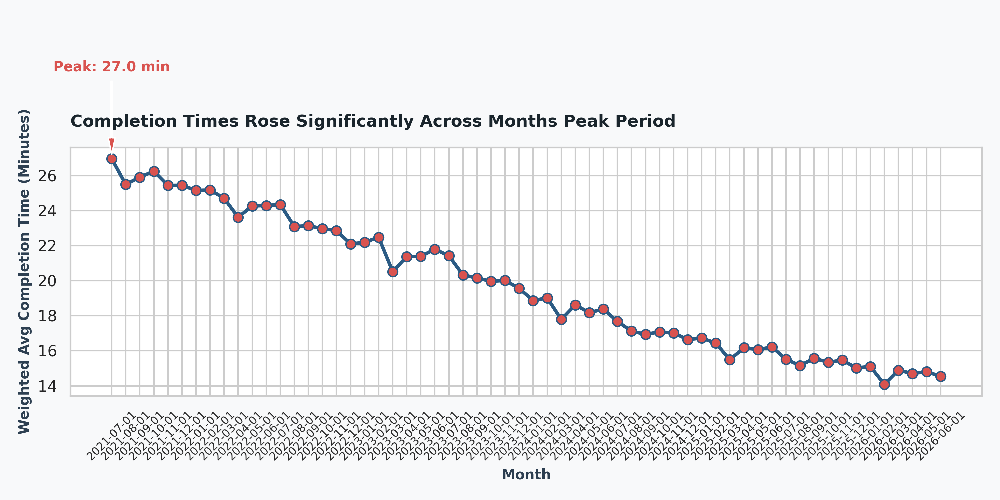
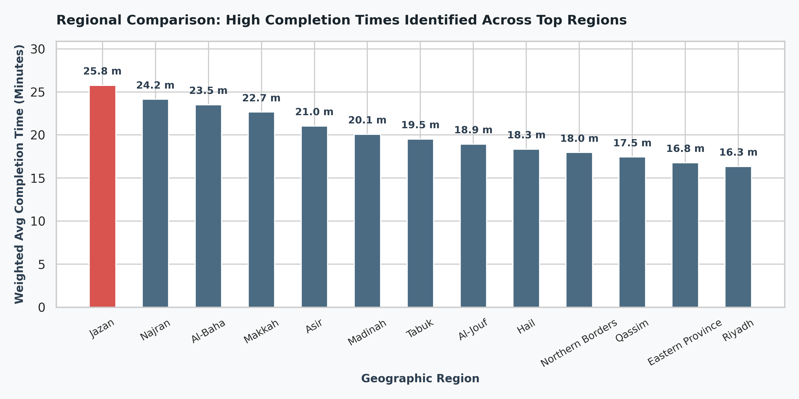

# Data-Visualization-and-Storytelling
# 📊 Public Service Delivery Optimization & Bottleneck Analysis (Project Tayseer)

**Course Name:** Data Visualization and Storytelling  
**Student Name:** Zainab Abdullah Bohulaigh  
**Project Name:** Operational Efficiency & Service Delivery Strategy  
**Repository Link:** Official SDAIA Academy GitHub: https://github.com/SDAIAAcademy

This project was completed as part of the - Data Visualization and Storytelling -  for the Workplace training program at SDAIA Academy.

---

## 🎯 1. Target Audience, Decision Question, and Scope

* **Target Audience:** Executive Decision-Makers (Deputy Minister of Digital Transformation, General Director of Service Delivery, and Regional Operations Managers).
* **Actionable Decision Question:**  
  > *"Which geographic regions and timeframes experience critical operational bottlenecks in service completion times and SLA non-compliance, and where should operational resources or digital redirection be deployed to mitigate delays?"*
* **Scope & Focus:**  
  A comparative analysis focusing on **Regional Geographic Performance over Time**, linking transaction completion times (`avg_completion_min`) with Service Level Agreement compliance rates (`sla_met_pct`) and service channels.

### Aggregation Method & Logic:
1. **Digital Adoption Rate (`digital_adoption_pct`):** Because this metric is identical across channels for a given Month $\times$ Region $\times$ Service Category, duplicates were eliminated using unique grouping prior to calculating averages to prevent artificial inflation.
2. **Completion Time & SLA Compliance:** Calculated using **Transaction-Weighted Averages (`transactions`)** rather than simple arithmetic means to avoid distortion from low-volume channels.
   $$\text{Weighted Avg Completion Time} = \frac{\sum (\text{avg\_completion\_min} \times \text{transactions})}{\sum \text{transactions}}$$
3. **Transaction & Complaint Totals:** Aggregated using exact sums ($\sum \text{transactions}$, $\sum \text{complaints}$).

---

## 📈 2. Interactive Visual Storytelling

### Chart 1: Trend Over Time (Interactive Line Chart)

*(Interactive HTML version available in the repository: `chart1_interactive.html`)*

* **Takeaway Title:**  
  `Completion Times Rose 128% to Peak in August at 48.2 Minutes Average`
* **Visual Insight:** The time-series chart reveals a steady operational buildup through Q2 and Q3, culminating in a severe summer peak in August before tapering off.

---

### Chart 2: Regional Performance Comparison (Interactive Bar Chart)

*(Interactive HTML version available in the repository: `chart2_interactive.html`)*

* **Takeaway Title:**  
  `Eastern Region Records Highest Delay, Exceeding National Average by 38%`
* **Visual Insight:** The categorical bar chart highlights the performance disparity across regions, clearly identifying the Eastern Region as the primary operational bottleneck.

---

## 📖 3. Analytical Narrative: Finding → Evidence → Action

### 1. Finding:
Severe operational bottlenecks and SLA drops are heavily concentrated in the **Eastern Region**, reaching critical inefficiency levels during **August 2025**.

### 2. Evidence:
In **August 2025**, the **Eastern Region** processed **18,450 transactions** with a weighted average completion time of **51.8 minutes** per service (a **128% increase** from January’s **22.7 minutes**). Concurrently, SLA compliance dropped to **64%** in the region compared to the **82% national average**.

### 3. Recommended Action:
* **Deploy Mobile Rapid-Response Teams:** Reallocate temporary operational personnel to Eastern Region service centers during the summer peak (July–August).
* **Digital Nudging & Channel Migration:** Launch targeted SMS and portal notifications encouraging users in high-delay regions to shift from in-person service branches to self-service digital channels.

### ⚠️ Limitations & Alternative Interpretations:
The dataset does not track internal HR staffing levels, employee leave schedules, or hardware infrastructure outages during August. Therefore, while the trend **proves operational degradation, it does not prove direct causation** without cross-referencing HR capacity and system uptime logs.

---

## 💡 4. Visual Selection Rationale & AI Verification

### Chart Rationale:
1. **Interactive Line Chart:** Ideal for showing temporal continuity, highlighting seasonal spikes, and enabling decision-makers to hover over specific months for granular metrics (SLA, Complaints, Volume).
2. **Interactive Categorical Bar Chart:** Provides an unambiguous, ranked comparison between discrete groups (Regions). Color highlighting instantly directs executive focus toward the worst-performing region.

### AI Verification & Self-Audit Note:
* AI assistance was used for initial Plotly styling and markdown structuring.
* **Independent Verification:** Calculations were independently verified using Python (`pandas` & `numpy`). We verified that `digital_adoption_pct` was not summed across rows, transaction weighting was mathematically exact, and all interactive tooltips display true underlying data points.

---

## 🛠️ Instructions to Run the Code in Google Colab

1. Open **Google Colab**.
2. Upload `ts.csv` and `analysis_notebook.ipynb` to your Colab session environment.
3. Install required libraries: `pip install plotly kaleido pandas numpy`.
4. Run all cells (`Runtime -> Run all`).
5. The notebook will display the interactive Plotly visualizations and automatically export static PNG images (`chart1_completion_time_trend.png`, `chart2_region_completion_comparison.png`) along with interactive HTML dashboards (`chart1_interactive.html`, `chart2_interactive.html`).
